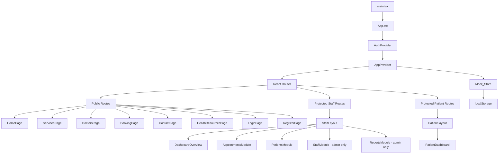
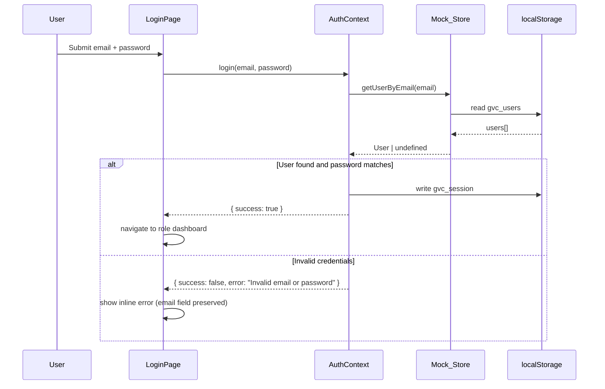

# Design Document

## Green Valley Clinic ICMS

---

## Overview

The Green Valley Clinic ICMS is a single-page application (SPA) built with React + Vite. It has two distinct surfaces sharing a single codebase and data layer:

1. **Staff Dashboard** — internal tool for admins, doctors, and receptionists
2. **Patient Portal / Public Website** — public-facing site with patient self-service

All data lives in a `Mock_Store` module backed by `localStorage`. There is no backend. React Context provides global state, and React Router v6 handles all navigation. The app is fully responsive using Tailwind CSS breakpoints.

---

## Architecture



### Key Architectural Decisions

- **Single Vite project** — both surfaces live under `/src`, separated by route prefix (`/staff/*` vs `/portal/*` vs `/`)
- **Context over Redux** — the app is a prototype; React Context + `useReducer` is sufficient and avoids extra dependencies
- **Mock_Store as a service module** — all data access goes through `src/data/mockStore.ts`, never directly to `localStorage`. This makes future backend replacement straightforward
- **Role-based route guards** — a `ProtectedRoute` component wraps all authenticated routes and checks role permissions
- **shadcn/ui** for complex components (dialogs, toasts, tables, forms); Tailwind for layout and custom styling

---

## Components and Interfaces

### Component Hierarchy

```
src/
├── components/
│   ├── ui/                        # shadcn/ui primitives (Button, Input, Dialog, etc.)
│   ├── layout/
│   │   ├── StaffLayout.tsx        # Sidebar + topbar shell for staff
│   │   ├── PublicLayout.tsx       # Navbar + footer shell for public pages
│   │   ├── PatientLayout.tsx      # Patient portal shell
│   │   ├── Sidebar.tsx            # Collapsible sidebar with role-filtered nav
│   │   ├── TopBar.tsx             # Staff topbar with user info
│   │   ├── PublicNavbar.tsx       # Public site navbar with hamburger
│   │   ├── BottomNav.tsx          # Mobile bottom nav (staff)
│   │   └── Breadcrumb.tsx         # Breadcrumb nav component
│   ├── appointments/
│   │   ├── AppointmentTable.tsx   # Searchable/filterable data table
│   │   ├── AppointmentForm.tsx    # Create/edit appointment form
│   │   ├── SlotPicker.tsx         # Date + time slot selector
│   │   └── StatusBadge.tsx        # Colored status pill
│   ├── patients/
│   │   ├── PatientTable.tsx       # Searchable patient list
│   │   ├── PatientForm.tsx        # Create/edit patient form
│   │   └── PatientDetail.tsx      # Full patient detail view
│   ├── staff/
│   │   ├── StaffTable.tsx         # Staff management table
│   │   └── StaffForm.tsx          # Add/edit staff form
│   ├── reports/
│   │   ├── AppointmentChart.tsx   # Bar chart: appointments by status
│   │   ├── PatientGrowthChart.tsx # Bar chart: new patients per month
│   │   └── DoctorWorkloadChart.tsx# Bar chart: appointments per doctor
│   ├── booking/
│   │   ├── BookingWizard.tsx      # Multi-step booking container
│   │   ├── StepSelectDoctor.tsx   # Step 1: doctor + service
│   │   ├── StepSelectSlot.tsx     # Step 2: date + time
│   │   └── StepConfirm.tsx        # Step 3: review + submit
│   ├── public/
│   │   ├── HeroSection.tsx
│   │   ├── ServicesOverview.tsx
│   │   ├── FeaturedDoctors.tsx
│   │   ├── DoctorCard.tsx
│   │   └── ArticleCard.tsx
│   └── shared/
│       ├── StatCard.tsx           # Dashboard stat card
│       ├── ActivityFeed.tsx       # Recent activity list
│       ├── ConfirmDialog.tsx      # Reusable confirmation dialog
│       ├── ToastProvider.tsx      # Toast stack manager
│       └── ProtectedRoute.tsx     # Auth + role guard
├── pages/
│   ├── staff/
│   │   ├── DashboardPage.tsx
│   │   ├── AppointmentsPage.tsx
│   │   ├── PatientsPage.tsx
│   │   ├── StaffPage.tsx
│   │   └── ReportsPage.tsx
│   ├── portal/
│   │   └── PatientDashboardPage.tsx
│   └── public/
│       ├── HomePage.tsx
│       ├── ServicesPage.tsx
│       ├── DoctorsPage.tsx
│       ├── BookingPage.tsx
│       ├── ContactPage.tsx
│       ├── HealthResourcesPage.tsx
│       ├── LoginPage.tsx
│       └── RegisterPage.tsx
├── context/
│   ├── AuthContext.tsx
│   └── AppContext.tsx
├── data/
│   ├── mockStore.ts               # Mock_Store API
│   ├── seed.ts                    # Initial seed data
│   └── mockArticles.ts            # Static health articles
├── hooks/
│   ├── useAuth.ts
│   ├── useAppointments.ts
│   ├── usePatients.ts
│   └── useToast.ts
└── lib/
    ├── utils.ts                   # cn(), date helpers
    ├── slotUtils.ts               # Slot availability logic
    └── validators.ts              # Form validation helpers
```

### Key Component Interfaces

```typescript
// ProtectedRoute
interface ProtectedRouteProps {
  allowedRoles: Role[];
  children: React.ReactNode;
}

// StatCard
interface StatCardProps {
  label: string;
  value: number | string;
  icon: React.ReactNode;
  trend?: { value: number; direction: 'up' | 'down' };
}

// SlotPicker
interface SlotPickerProps {
  doctorId: string;
  date: string;           // ISO date string YYYY-MM-DD
  onSlotSelect: (slot: TimeSlot) => void;
  selectedSlot?: TimeSlot;
}

// BookingWizard
interface BookingWizardProps {
  preselectedDoctorId?: string;
}

// ConfirmDialog
interface ConfirmDialogProps {
  open: boolean;
  title: string;
  description: string;
  onConfirm: () => void;
  onCancel: () => void;
  variant?: 'destructive' | 'default';
}
```

---

## Data Models

### User

```typescript
type Role = 'admin' | 'doctor' | 'receptionist' | 'patient';

interface User {
  id: string;           // uuid
  email: string;
  passwordHash: string; // bcrypt-style hash (simulated in prototype)
  role: Role;
  name: string;
  isActive: boolean;
  createdAt: string;    // ISO datetime
}
```

### Patient

```typescript
interface Patient {
  id: string;
  userId?: string;      // linked User account (if registered via portal)
  name: string;
  email: string;
  phone: string;
  dateOfBirth: string;  // YYYY-MM-DD
  gender: 'male' | 'female' | 'other';
  address?: string;
  medicalHistory: MedicalHistoryEntry[];
  createdAt: string;
  updatedAt: string;
}

interface MedicalHistoryEntry {
  id: string;
  date: string;
  note: string;
  doctorId: string;
}
```

### Doctor

```typescript
interface Doctor {
  id: string;
  userId: string;       // linked User account
  name: string;
  specialty: string;
  bio: string;
  email: string;
  phone: string;
  avatarUrl?: string;
  isAvailable: boolean;
  workingHours: WorkingHours;
  services: string[];   // service IDs
}

interface WorkingHours {
  // day index 0=Sun, 1=Mon ... 6=Sat
  [day: number]: { start: string; end: string } | null; // null = day off
}
```

### Appointment

```typescript
type AppointmentStatus = 'Pending' | 'Confirmed' | 'Completed' | 'Cancelled';

interface Appointment {
  id: string;
  patientId: string;
  doctorId: string;
  serviceId: string;
  date: string;         // YYYY-MM-DD
  time: string;         // HH:MM (24h)
  status: AppointmentStatus;
  notes?: string;
  bookingRef: string;   // e.g. "GVC-20240115-0042"
  createdAt: string;
  updatedAt: string;
}
```

### Staff

```typescript
interface StaffMember {
  id: string;
  userId: string;
  name: string;
  role: 'admin' | 'doctor' | 'receptionist';
  email: string;
  phone?: string;
  isActive: boolean;
  createdAt: string;
}
```

### Service

```typescript
interface Service {
  id: string;
  name: string;
  description: string;
  icon: string;         // Font Awesome icon name
  doctorIds: string[];
  durationMinutes: number;
}
```

### TimeSlot

```typescript
interface TimeSlot {
  time: string;         // HH:MM
  isAvailable: boolean;
}
```

### ActivityLog

```typescript
interface ActivityLogEntry {
  id: string;
  timestamp: string;
  message: string;      // e.g. "New patient registered: Jane Doe"
  type: 'create' | 'update' | 'delete' | 'auth';
  userId?: string;
}
```

### HealthArticle

```typescript
interface HealthArticle {
  id: string;
  title: string;
  category: 'Nutrition' | 'Mental Health' | 'Preventive Care' | 'Fitness' | 'General';
  summary: string;
  content: string;      // full article markdown/HTML
  publishedAt: string;
  imageUrl?: string;
}
```

---

## Mock_Store API Design

The `Mock_Store` is the single source of truth. It reads/writes to `localStorage` and exposes a typed API. All operations log to the activity feed.

```typescript
// src/data/mockStore.ts

interface MockStore {
  // Initialization
  initialize(): void;   // seeds data if localStorage is empty

  // Patients
  getPatients(): Patient[];
  getPatientById(id: string): Patient | undefined;
  createPatient(data: Omit<Patient, 'id' | 'createdAt' | 'updatedAt'>): Patient;
  updatePatient(id: string, data: Partial<Patient>): Patient;
  deletePatient(id: string): void;

  // Appointments
  getAppointments(): Appointment[];
  getAppointmentById(id: string): Appointment | undefined;
  getAppointmentsByPatient(patientId: string): Appointment[];
  getAppointmentsByDoctor(doctorId: string): Appointment[];
  createAppointment(data: Omit<Appointment, 'id' | 'bookingRef' | 'createdAt' | 'updatedAt'>): Appointment;
  updateAppointment(id: string, data: Partial<Appointment>): Appointment;
  deleteAppointment(id: string): void;

  // Doctors
  getDoctors(): Doctor[];
  getDoctorById(id: string): Doctor | undefined;
  updateDoctor(id: string, data: Partial<Doctor>): Doctor;

  // Staff
  getStaff(): StaffMember[];
  getStaffById(id: string): StaffMember | undefined;
  createStaff(data: Omit<StaffMember, 'id' | 'createdAt'>): StaffMember;
  updateStaff(id: string, data: Partial<StaffMember>): StaffMember;

  // Users / Auth
  getUserByEmail(email: string): User | undefined;
  createUser(data: Omit<User, 'id' | 'createdAt'>): User;
  updateUser(id: string, data: Partial<User>): User;

  // Activity Log
  getActivityLog(): ActivityLogEntry[];

  // Slot availability
  getAvailableSlots(doctorId: string, date: string): TimeSlot[];
}
```

### Persistence Strategy

- On every write operation, the store serializes the affected collection to `localStorage` using `JSON.stringify`
- Key names: `gvc_patients`, `gvc_appointments`, `gvc_doctors`, `gvc_staff`, `gvc_users`, `gvc_activity_log`
- A `gvc_initialized` flag prevents re-seeding on subsequent loads
- Writes are synchronous (localStorage is synchronous) — the 100ms requirement is trivially met

### Booking Reference Generation

```typescript
function generateBookingRef(appointmentId: string): string {
  const date = new Date().toISOString().slice(0, 10).replace(/-/g, '');
  const seq = String(getAppointments().length + 1).padStart(4, '0');
  return `GVC-${date}-${seq}`;
}
```

---

## State Management

### AuthContext

```typescript
interface AuthContextValue {
  user: User | null;
  isAuthenticated: boolean;
  login(email: string, password: string): Promise<{ success: boolean; error?: string }>;
  logout(): void;
  register(data: RegisterPayload): Promise<{ success: boolean; error?: string }>;
}
```

Session is stored in `localStorage` under `gvc_session` as a serialized `User` object (minus `passwordHash`). On app load, `AuthProvider` reads this key to restore the session.

### AppContext

```typescript
interface AppContextValue {
  patients: Patient[];
  appointments: Appointment[];
  doctors: Doctor[];
  staff: StaffMember[];
  activityLog: ActivityLogEntry[];
  refreshPatients(): void;
  refreshAppointments(): void;
  refreshAll(): void;
  addToast(toast: ToastPayload): void;
}
```

`AppContext` holds the in-memory snapshot of Mock_Store data. After any CRUD operation, the relevant `refresh*` function is called to re-read from Mock_Store and trigger a re-render.

---

## Routing Structure

```typescript
// React Router v6 route tree

<Routes>
  {/* Public routes */}
  <Route path="/" element={<PublicLayout />}>
    <Route index element={<HomePage />} />
    <Route path="services" element={<ServicesPage />} />
    <Route path="doctors" element={<DoctorsPage />} />
    <Route path="book" element={<BookingPage />} />
    <Route path="contact" element={<ContactPage />} />
    <Route path="health-resources" element={<HealthResourcesPage />} />
    <Route path="login" element={<LoginPage />} />
    <Route path="register" element={<RegisterPage />} />
  </Route>

  {/* Patient portal (protected: role=patient) */}
  <Route path="/portal" element={
    <ProtectedRoute allowedRoles={['patient']}>
      <PatientLayout />
    </ProtectedRoute>
  }>
    <Route index element={<PatientDashboardPage />} />
  </Route>

  {/* Staff dashboard (protected: role=admin|doctor|receptionist) */}
  <Route path="/staff" element={
    <ProtectedRoute allowedRoles={['admin', 'doctor', 'receptionist']}>
      <StaffLayout />
    </ProtectedRoute>
  }>
    <Route index element={<DashboardPage />} />
    <Route path="appointments" element={<AppointmentsPage />} />
    <Route path="patients" element={<PatientsPage />} />
    <Route path="patients/:id" element={<PatientDetailPage />} />
    <Route path="staff" element={
      <ProtectedRoute allowedRoles={['admin']}>
        <StaffPage />
      </ProtectedRoute>
    } />
    <Route path="reports" element={
      <ProtectedRoute allowedRoles={['admin']}>
        <ReportsPage />
      </ProtectedRoute>
    } />
  </Route>

  {/* Fallback */}
  <Route path="*" element={<Navigate to="/" replace />} />
</Routes>
```

---

## Auth Flow



**Password handling**: In this prototype, passwords are stored as plain strings in `localStorage` (no real hashing). The `passwordHash` field name is kept for semantic clarity and future-proofing.

**Session restoration**: On `AuthProvider` mount, it reads `gvc_session` from `localStorage`. If present and the user's `isActive` is `true`, the session is restored without re-login.

**Role redirect logic**:
- `admin` / `doctor` / `receptionist` → `/staff`
- `patient` → `/portal`

---

## Appointment Slot Logic

Slot availability is computed in `src/lib/slotUtils.ts`.

### Slot Generation

```typescript
const SLOT_DURATION_MINUTES = 30;

function generateSlots(doctor: Doctor, date: string): TimeSlot[] {
  const dayOfWeek = new Date(date).getDay();
  const hours = doctor.workingHours[dayOfWeek];
  if (!hours) return []; // doctor's day off

  const slots: TimeSlot[] = [];
  let current = parseTime(hours.start);
  const end = parseTime(hours.end);

  while (current + SLOT_DURATION_MINUTES <= end) {
    slots.push({ time: formatTime(current), isAvailable: true });
    current += SLOT_DURATION_MINUTES;
  }
  return slots;
}
```

### Availability Check

```typescript
function getAvailableSlots(doctorId: string, date: string): TimeSlot[] {
  const doctor = mockStore.getDoctorById(doctorId);
  if (!doctor) return [];

  const allSlots = generateSlots(doctor, date);
  const bookedAppointments = mockStore.getAppointmentsByDoctor(doctorId)
    .filter(a => a.date === date && a.status !== 'Cancelled');

  const bookedTimes = new Set(bookedAppointments.map(a => a.time));

  return allSlots.map(slot => ({
    ...slot,
    isAvailable: !bookedTimes.has(slot.time),
  }));
}
```

### Double-Booking Prevention

When a new appointment is submitted:
1. `getAvailableSlots()` is called immediately before saving
2. If the target slot is no longer available, the save is rejected and an error toast is shown
3. This handles the race condition described in Requirement 12.5

---

## Error Handling

| Scenario | Handling |
|---|---|
| Invalid login credentials | Inline error below password field; email preserved |
| Duplicate email on registration | Inline error: "An account with this email already exists." |
| Required form field empty | Inline validation error beneath the field on submit |
| Slot taken between selection and submit | Error toast + prompt to re-select slot |
| Destructive action (delete/cancel) | `ConfirmDialog` before execution |
| Successful CRUD operation | Green success toast (≥3s) |
| Failed CRUD operation | Red error toast |
| Unauthenticated route access | Redirect to `/login` |
| Deactivated account login attempt | Inline error: "Your account has been deactivated." |
| localStorage unavailable | Graceful fallback to in-memory only (no persistence) |

---

## Testing Strategy

This feature is a React UI prototype with no backend. The primary testing concerns are:

- **Form validation logic** — pure functions that can be unit tested
- **Slot availability logic** — pure functions with clear input/output behavior
- **Mock_Store CRUD operations** — data transformation logic
- **Auth flow** — session management logic

### Unit Tests

Focus on pure utility functions:
- `slotUtils.ts`: `generateSlots`, `getAvailableSlots`
- `validators.ts`: all form validation functions
- `mockStore.ts`: CRUD operations, booking ref generation
- `lib/utils.ts`: date helpers, formatting functions

### Property-Based Tests

See Correctness Properties section below.

### Integration / Smoke Tests

- Verify the app renders without crashing at each major route
- Verify `Mock_Store.initialize()` seeds the correct number of records
- Verify role-based route guards redirect correctly

### Testing Libraries

- **Vitest** — test runner (matches Vite ecosystem)
- **fast-check** — property-based testing library for TypeScript
- **@testing-library/react** — component testing
- Each property test runs a minimum of **100 iterations**
- Tag format: `// Feature: green-valley-clinic-icms, Property N: <property text>`

---

## Correctness Properties

*A property is a characteristic or behavior that should hold true across all valid executions of a system — essentially, a formal statement about what the system should do. Properties serve as the bridge between human-readable specifications and machine-verifiable correctness guarantees.*

